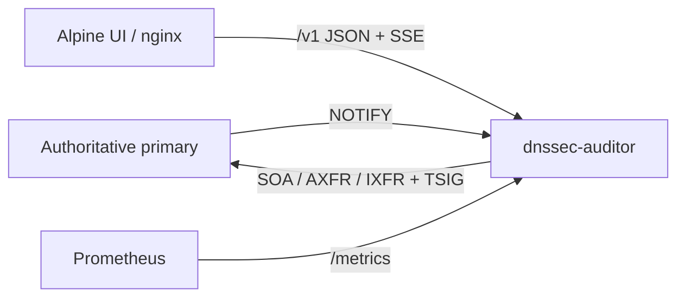

# Architecture

## Overview

DNSSEC Auditor is a read-only monitor. Authoritative DNS servers remain the source of truth. The auditor transfers zones, verifies DNSSEC, and publishes state.

The HTTP API is built with [Huma](https://huma.rocks/) on Go's `http.ServeMux`. OpenAPI 3.1 is served at `/openapi.json` and interactive docs at `/docs`. Prometheus `/metrics` remains a raw handler outside the OpenAPI document.

## Verification

A full pass implements Knot's `dnssec-validation` checks plus ZONEMD and hygiene warnings:

- Every authoritative RRset has a verifying RRSIG from a present ZONE-flag DNSKEY
- DNSKEY is signed by a KSK
- NSEC or NSEC3 chain is closed, bitmaps match, opt-out is honoured
- ZONEMD compared when present or required

An incremental pass after IXFR re-verifies touched names and neighbouring NSEC3 records. DNSKEY or NSEC3PARAM changes escalate to a full pass. Findings are keyed so they can be retired individually.

## Refresh

Per-zone state: `unknown → transferring → verifying → valid | invalid | unsigned`, plus `transfer_failed` and `stale` (SOA EXPIRE). Next refresh is `clamp(SOA REFRESH, min, max)` with jitter. Failures back off using clamped SOA RETRY.

## In-memory store

Records are stored as packed wire RRs on interned owner names, with btree indexes for NSEC3 hashes and RRSIG expirations. AXFR builds a new store and swaps it. Optional snapshots allow IXFR-resume after restart.

## Events

An in-process bus fans out to SSE (`GET /v1/events`), webhooks, structured wide-event logs, and Prometheus counters.
